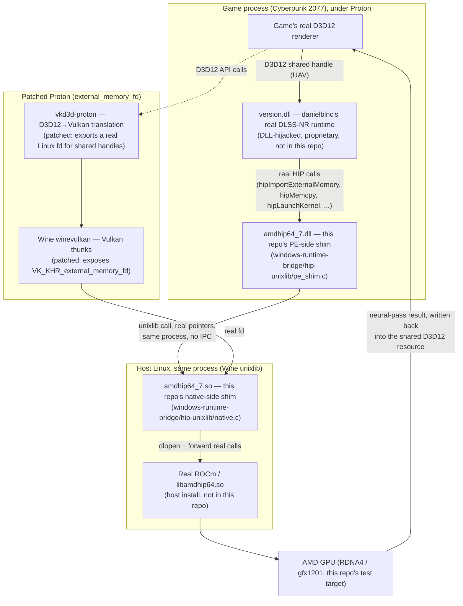

# dlssnr-on-amd-linux

Linux/Proton support for [danielblnc/DLSS-NR-on-AMD](https://github.com/danielblnc/DLSS-NR-on-AMD) — a real ROCm/HIP compatibility shim, no proprietary code or weights included.

## What this is

[danielblnc/DLSS-NR-on-AMD](https://github.com/danielblnc/DLSS-NR-on-AMD) is a standalone Windows runtime that brings NVIDIA's DLSS 5 Neural Rendering ("DLSS-NR") to AMD GPUs, by DLL-hijacking a game's `version.dll`. It's built against NVIDIA's real `amdhip64_7.dll` (AMD's own HIP compute runtime) and calls into it directly for GPU compute and D3D12↔HIP memory interop.

This repo gets that runtime working under Wine/Proton on Linux. It does **not** reimplement or ship any of Daniel's runtime, NVIDIA's weights, or any proprietary code — it builds a real HIP compute shim (a Wine [unixlib](https://gitlab.winehq.org/wine/wine/-/wikis/Unix-Library-Guide) module) that forwards Daniel's runtime's real HIP calls through to the host's real ROCm install, plus small, focused patches to two upstream open-source projects needed to make D3D12 shared-handle memory interop actually work correctly under Proton:

- [HansKristian-Work/vkd3d-proton](https://github.com/HansKristian-Work/vkd3d-proton) — an opt-in `VKD3D_CONFIG=external_memory_fd` patch exposing real Linux file descriptors for D3D12 shared handles. (No dedicated Discord published on the repo; general discussion happens on its GitHub issues.)
- [ValveSoftware/wine](https://github.com/ValveSoftware/wine) (the Proton fork) — a one-line `winevulkan` fix exposing `VK_KHR_external_memory_fd` through Wine's Vulkan thunks (present but deliberately hidden in Wine's own generator). (No dedicated Discord published on the repo.)

**Target scope: Cyberpunk 2077, AMD Radeon RX 9070 XT (RDNA4, gfx1201).** That's the only game/GPU combination this has actually been built and tested against so far — not a claim of broader compatibility. Other RDNA GPUs or games may or may not work; nobody's verified either way yet.

## How it fits together



Everything inside "Patched Proton" and "Host Linux" is real, open-source glue built or patched by this repo. `version.dll` and the GPU compute kernels it runs are danielblnc's closed-source runtime — never included here, only called into.

## Support / community

This repo is Linux-glue code for someone else's runtime, not a community hub. For general DLSS-NR questions, setup help, or to see what other games/GPUs people are trying it on, go to the actual project communities instead:

- danielblnc/DLSS-NR-on-AMD Discord: https://discord.gg/5gCwc6mskc
- zmodelerlover/dlss5-neural-amd Discord: https://discord.gg/wYhvS3JSHM

These are primarily the Windows DLSS5 mod communities, not Linux-specific — but they're the closest thing to a community this project has right now, so Linux-related discussion is welcome there too for now, until that changes (a dedicated space, GitHub Discussions, or similar).

## Credits / prior art

- [zmodelerlover/dlss5-neural-amd](https://github.com/zmodelerlover/dlss5-neural-amd) (MIT) — a sibling Windows/ReShade project driving the same danielblnc runtime. Its `tools/extract_runtime.py` (a read-only PE-parsing script that carves the runtime payload out of danielblnc's own official installer, without executing it) and `src/vkbridge/vkbridge.cpp` (its Vulkan resource-interop bridge for the same runtime) were read as engineering reference for this project's own D3D12↔HIP interop and runtime-extraction work — nothing from it is vendored or copied into this repo, only consulted for pattern/approach. Not affiliated with this project or with danielblnc.
- [guentra/dlss5-amd-hip-linux](https://github.com/guentra/dlss5-amd-hip-linux) (MIT) — an independent, from-scratch HIP/rocWMMA reimplementation of the DLSS-NR network itself (no dependency on danielblnc's runtime at all). Two small files under `windows-runtime-bridge/investigations/` (`snapshot_gate.h`/`.c`, and the ring-buffer submission logic in `faithful_submission_probe.c`) are adapted from its `native_snapshot_gate.h`/`native_game_submission.h` — see `THIRD-PARTY.md` for the full license notice. Not affiliated with this project.

## What you need separately

This repo is glue code and patches only. To actually use any of this, you need:

- [danielblnc/DLSS-NR-on-AMD](https://github.com/danielblnc/DLSS-NR-on-AMD)'s real runtime (not included here — closed-source, get it from Daniel's own repo/releases).
- A real AMD GPU with ROCm installed on the host (see `docs/linux-support-spec.md` for the exact versions this has been validated against).
- A Proton build with the two patches above applied — see `windows-runtime-bridge/proton-patches/` for the raw patch files and full build/test instructions (no upstream PRs are open yet, so this is the only way to get them right now), and `docs/linux-support-spec.md` for the full narrative.

## Running the two backends

There are two independent ways to get DLSS-NR-equivalent rendering running: this project's own `danielblnc` backend (the one described above), and `guentra`'s separate, independent open-source reimplementation. They can't run at the same time — `windows-runtime-bridge/backends/switch_backend.sh` switches between them and prints the correct Steam launch options for whichever is now active.

Neither backend's actual runtime files live in this repo or get committed anywhere — see "Why files aren't deployed from this repo" below for why that's deliberate, not an oversight.

### `danielblnc` backend

**Requires:**
- A real AMD GPU with ROCm installed on the host (`rocminfo`, `libamdhip64`).
- `wine64-tools`, `clang`, `lld` (build-time only, for `hip-unixlib`).
- [danielblnc/DLSS-NR-on-AMD](https://github.com/danielblnc/DLSS-NR-on-AMD)'s real runtime files — closed-source, get them from Daniel's own installer/releases (never included in this repo). You need `version.dll` and his weights file next to the game's `.exe`.

`switch_backend.sh daniel` only prints launch options and checks that `version.dll` is present — the Proton build and the HIP shim have to be built and installed once, manually, first:

1. **Build a patched Proton** via `windows-runtime-bridge/proton-patches/` (full instructions in that folder — clone `ValveSoftware/Proton`, apply the two patches, build via Valve's official SDK container, install as a custom compatibility tool under `~/.steam/root/compatibilitytools.d/`). No upstream PRs are open yet, so this is currently the only way to get a working build.
2. **Build and install this project's HIP shim** into that same patched Proton install (`windows-runtime-bridge/hip-unixlib/README.md` has the exact steps):
   ```sh
   cd windows-runtime-bridge/hip-unixlib && make
   cp x86_64-windows/amdhip64_7.dll "<Proton>/files/lib/wine/x86_64-windows/"
   cp x86_64-unix/amdhip64_7.so "<Proton>/files/lib/wine/x86_64-unix/"
   winebuild --builtin "<Proton>/files/lib/wine/x86_64-windows/amdhip64_7.dll"
   ```
3. **Place Daniel's own `version.dll` and weights file** next to the game's `.exe` (obtained separately — never distributed here).
4. Then run:
   ```sh
   windows-runtime-bridge/backends/switch_backend.sh daniel --exe /path/to/Cyberpunk2077.exe
   ```
   and paste the printed launch options into Steam → game Properties → Launch Options, with the patched Proton build selected as the compatibility tool.

Steps 1–2 are one-time, per-Proton-build setup — only step 3–4 need repeating per game/reinstall.

### `guentra` backend

**Requires:**
- guentra's real release, downloaded and checksum-verified from [his GitHub releases](https://github.com/guentra/dlss5-amd-hip-linux/releases) — extract it under `windows-runtime-bridge/backends/guentra/vendor/dlss5-amd-hip-linux-vX.Y.Z/` (gitignored).
- Your own genuine `nvngx_dlssnr.dll` (NVIDIA's real DLSS Neural Rendering DLL, v310.8.0.0) — his own installer pins its exact SHA256 and refuses anything else (including patched/modified redistributions). Not distributed by NVIDIA through any public channel as of this writing (confirmed against NVIDIA's own NGX update server config — see `docs/linux-support-spec.md` §74a) — you need to source this yourself. Kept local-only under `windows-runtime-bridge/backends/guentra/vendor/nvidia-source/` (gitignored), never committed.
- Python 3.10+, `numpy`/`Pillow` (`pip install -r` his `requirements.txt`), and a real ROCm/HIP install on the host.
- A Proton build (stock or this project's patched one both work — his backend doesn't need `external_memory_fd`, it uses CPU readback/upload).

**Run it:**
```sh
windows-runtime-bridge/backends/switch_backend.sh guentra \
    --exe /path/to/Cyberpunk2077.exe \
    --package /path/to/nvngx_dlssnr.dll \
    --runner /path/to/proton-install-dir
```
This runs his real `install.sh` (unmodified), then automatically applies a small, fully-decoupled local fix for a real launch-sandbox bug found on this exact Proton/Steam-Runtime setup (global `LD_PRELOAD` colliding with Steam's own sandbox bootstrap — see `docs/linux-support-spec.md` §74c/§74g for the full story). The printed `launch_options` string (from his own installer's output) is what goes into Steam.

### Why files aren't deployed from this repo

guentra's real installer deploys its files as real copies directly into the game's own directory (`d3d12.dll`, `d3d12core.dll`, `dlss5_hip.dll`, the converted weight tiles, etc.), not symlinks back to a shared source. This is intentional, not something this project's tooling changes:

- None of these files could be committed to this repo anyway — they're either closed-source (danielblnc's runtime), derived from your own NVIDIA DLL (guentra's converted weights), or third-party binaries under their own licenses (guentra's release archive). They already live only in gitignored vendor folders, never in git history.
- guentra's own installer tracks a real per-file checksum manifest for its own integrity/uninstall system (`.dlssnr-linux/manifest.json`) built around real files at real paths — replacing that with symlinks would change his tool's actual behavior, which runs against this project's explicit goal of staying as close to his real, unmodified implementation as possible, so findings here stay reportable upstream against what a normal user of his tool would actually experience.
- Windows/Wine's own DLL search order expects these files to sit next to the game executable regardless — there's no meaningful reduction in duplication to be had by symlinking, since the "source of truth" copy already exists in exactly one gitignored place (`windows-runtime-bridge/backends/guentra/vendor/`) and the game-directory copy is just his own installer's normal, expected deployment of it.

## Repo layout

- **`windows-runtime-bridge/hip-unixlib/`** — the active HIP compute shim: a PE-side stub (`pe_shim.c`, built as `amdhip64_7.dll`) paired with native Linux code (`native.c`, built as `amdhip64_7.so`) that runs in the same process under Wine and forwards real calls into the host's real ROCm/HIP runtime.
- **`windows-runtime-bridge/investigations/`** — standalone Linux diagnostics that talk to the real ROCm runtime directly, independent of Wine/Proton/the game, used to isolate and confirm real hardware/driver behavior during this investigation.
- **`windows-runtime-bridge/hip-bridge/`** and **`windows-runtime-bridge/hip-stub/`** — earlier, superseded designs (a socket-IPC daemon, and a Rust port), kept for reference.
- **`windows-runtime-bridge/proton-patches/`** — the raw patch files against Wine/vkd3d-proton needed for D3D12↔HIP memory interop, plus instructions to build a patched Proton yourself via Valve's own official build pipeline. No upstream PRs are open yet, so this is currently the only way to get them.
- **`windows-runtime-bridge/backends/`** — docs and a switch script for choosing between this project's own (`danielblnc`) backend and guentra's independent reimplementation (`guentra`) — the two can't coexist in the same game install at once.
- **`docs/linux-support-spec.md`** — the full investigation log: every finding, every patch, every dead end, every live test result, in chronological order. This is the real source of truth for "why" and "exactly what happened" behind every decision in this repo.
- **`CLAUDE.md`** — a working summary for picking this project back up, including current status and how everything here has actually been tested.

## Status

**This does not currently work well enough for normal play. Read this before trying it.**

The shim itself does its job: it forwards real HIP calls from Daniel's runtime through to the host's real ROCm driver, and the D3D12↔HIP memory interop patches do make shared-handle resources actually work under Proton. DLSS-NR does initialize and does run real neural-network jobs on the GPU through this path — that part is verified via logs and driver-level evidence, not aspirational.

**What's not yet verified: whether the DLSS-NR output is visibly correct on screen.** Everything confirmed so far is at the compute/dispatch level (jobs launch, run, and return a result) — nobody has yet visually confirmed in-game that the rendered picture reflects a correct DLSS-NR pass (proper denoising/upscaling quality, no visible artifacts). Given the severity of the timeout issue below, sessions so far haven't been stable enough to do that comparison properly. Treat DLSS-NR's actual visual output quality under this setup as unverified until someone reports back on it.

But a real interactive play session (not a synthetic benchmark) shows two separate unresolved problems:

- **Severe performance**: Daniel's own capture-check times out on the large majority of jobs before eventually succeeding via retry/fallback. Each timeout costs real wall-clock time — the actual neural-network compute is fast (~20ms), but the game ends up waiting roughly 150ms per frame for it. In practice this is the difference between playable and single-digit FPS. Root cause not identified yet — several plausible levers (stream ordering, wait-mode settings, submission queue mode) have been tested and ruled out; see `docs/linux-support-spec.md` for the full trail.
- **Occasional GPU ring hangs**: a GPU-side spin-wait pattern in the default configuration can trigger a real, kernel-level AMDGPU ring timeout and reset, invisible to the game/Vulkan (no crash, no error — the picture just freezes or stalls). Setting `CpuWait=1` in Daniel's own `dlssnr_on_amd.ini` avoids this reliably in testing, but is a workaround, not a fix, and hasn't been stress-tested for hours-long sessions.

So: expect DLSS-NR to turn on and run compute jobs on the GPU — but expect it to be rough, slow, not something to rely on for actual gameplay yet, and not yet confirmed to look visibly correct on screen. See `CLAUDE.md` for the current working summary and `docs/linux-support-spec.md` for the full, detailed history of every finding, patch, and dead end.

**This is a proof of concept, not a committed long-term project.** It demonstrates that the interop approach is technically possible, not that it's the approach that ends up working out. Whether this keeps being developed further depends on how the two unresolved problems above go — if they turn out to be fixable, or if danielblnc's own runtime evolves in a way that helps, this continues; if not, it may just stay as a documented dead end others can learn from instead.

The goal has always been bringing DLSS-NR to Linux gamers — the shim design in this repo is not presented as the final or only way to get there, just the approach that's been worked through and validated so far. If a cleaner or more robust path emerges (here or elsewhere), that's a win, not a competing claim.

## Contributing / forking

This repo is explicitly designed to be forked and reused however you find useful — for a different game, a different GPU family, a different shim approach entirely. Fork it, rip pieces out, go a different direction. No permission needed, MIT covers it.

Pull requests are welcome too. Given how much of this project's actual debugging time has gone into chasing regressions that a test would have caught immediately (see `docs/linux-support-spec.md` for several real examples), I'll likely ask for real test coverage on non-trivial changes before merging, and reserve the right to decline a PR that doesn't have it — not a rejection of the idea, just a bar for what goes into the tree here.

**A note on maintenance bandwidth**: this is a side project maintained by one person with limited time. If it gets a lot of attention and a large volume of issues/PRs comes in, response times may be slow, and some things may go unanswered for a while — not a reflection of priority, just a capacity limit. If that becomes a real bottleneck, forking (see above) is genuinely encouraged rather than waiting on this repo.

## Scope / what's deliberately excluded

No proprietary code, weights, or binaries from NVIDIA or danielblnc are included anywhere in this repo, and never will be. Anything that would require bundling either is kept out (see `.gitignore`).

A small number of short, factual details extracted from danielblnc's compiled binary via two static, read-only techniques — `strings` (config key names, individual log messages) and `objdump -p` (which functions his runtime imports, by name, from the header's import table only) — are quoted in `docs/linux-support-spec.md` to document real, observed interoperability behavior. Neither technique executes the binary or disassembles/decompiles its actual instruction logic. Referencing his project by name, and describing how it behaves, isn't a copyright concern. Whether static extraction like this crosses a line his own EULA draws around reverse engineering is a separate, genuinely open question this project can't resolve on its own — it's a contract question, not something settled by picking a permissive technique. This project deliberately stayed at the lower-risk end (no disassembly, no decompilation, nothing executed beyond normal use) rather than assuming that settles it.

## NVIDIA

DLSS, DLSS5 Neural Rendering, and the underlying technology are NVIDIA Corporation's. This project is not affiliated with, endorsed by, or sponsored by NVIDIA. No NVIDIA code, models, or weights are included here — and per `docs/linux-support-spec.md`, the weights file danielblnc's runtime uses is itself believed to be NVIDIA-derived, a separate licensing layer this project has no visibility into or control over.

## License

This repo's own original code (the HIP shim in `windows-runtime-bridge/hip-unixlib/`, the diagnostics in `windows-runtime-bridge/investigations/`, docs, and everything else authored here) is licensed under the [MIT License](LICENSE). See [THIRD-PARTY.md](THIRD-PARTY.md) for the notice covering the small amount of code adapted from another MIT-licensed project.

The two upstream projects this work patches are **not** MIT:

- [Wine](https://github.com/ValveSoftware/wine) and [vkd3d-proton](https://github.com/HansKristian-Work/vkd3d-proton) are both licensed under the **GNU Lesser General Public License v2.1 (LGPL-2.1)**, not GPL. The raw patch files against them live in `windows-runtime-bridge/proton-patches/` (no upstream PRs are open yet, so this repo is currently the only place to get them) — **but those two `.patch` files are explicitly excluded from this repo's MIT grant**, since a diff against LGPL-2.1 source can't be unilaterally relicensed; see that directory's own README for the full explanation. If you build and distribute a patched Wine or vkd3d-proton yourself, that combined work is governed by their LGPL-2.1 terms, not this repo's MIT license.

danielblnc's DLSS-NR-on-AMD runtime is closed-source and not included here at all — its licensing terms are Daniel's own, not this repo's.
