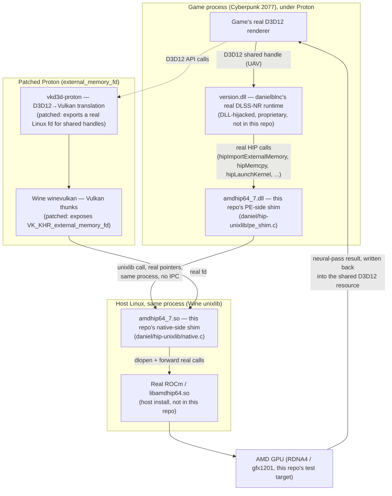

# dlssnr-on-amd-linux

Linux/Proton support for [danielblnc/DLSS-NR-on-AMD](https://github.com/danielblnc/DLSS-NR-on-AMD) — a real ROCm/HIP compatibility shim, no proprietary code or weights included.

## What this is

[danielblnc/DLSS-NR-on-AMD](https://github.com/danielblnc/DLSS-NR-on-AMD) is a standalone Windows runtime that brings NVIDIA's DLSS 5 Neural Rendering ("DLSS-NR") to AMD GPUs, by DLL-hijacking a game's `version.dll`. It's built against NVIDIA's real `amdhip64_7.dll` (AMD's own HIP compute runtime) and calls into it directly for GPU compute and D3D12↔HIP memory interop.

This repo gets that runtime working under Wine/Proton on Linux. It does **not** reimplement or ship any of Daniel's runtime, NVIDIA's weights, or any proprietary code — it builds a real HIP compute shim (a Wine [unixlib](https://gitlab.winehq.org/wine/wine/-/wikis/Unix-Library-Guide) module) that forwards Daniel's runtime's real HIP calls through to the host's real ROCm install, plus small, focused patches to two upstream open-source projects needed to make D3D12 shared-handle memory interop actually work correctly under Proton:

- [HansKristian-Work/vkd3d-proton](https://github.com/HansKristian-Work/vkd3d-proton) — an opt-in `VKD3D_CONFIG=external_memory_fd` patch exposing real Linux file descriptors for D3D12 shared handles. (No dedicated Discord published on the repo; general discussion happens on its GitHub issues.)
- [ValveSoftware/wine](https://github.com/ValveSoftware/wine) (the Proton fork) — a one-line `winevulkan` fix exposing `VK_KHR_external_memory_fd` through Wine's Vulkan thunks (present but deliberately hidden in Wine's own generator). (No dedicated Discord published on the repo.)

Tested against Cyberpunk 2077 on an AMD Radeon RX 9070 XT (RDNA4, gfx1201).

## How it fits together

Everything inside "Patched Proton" and "Host Linux" is real, open-source glue built or patched by this repo. `version.dll` and the GPU compute kernels it runs are danielblnc's closed-source runtime — never included here, only called into.

## Support / community

This repo is Linux-glue code for someone else's runtime, not a community hub. For general DLSS-NR questions, setup help, or to see what other games/GPUs people are trying it on, go to the actual project communities instead:

- danielblnc/DLSS-NR-on-AMD Discord: https://discord.gg/5gCwc6mskc
- zmodelerlover/dlss5-neural-amd Discord: https://discord.gg/wYhvS3JSHM

## Credits / prior art

- [zmodelerlover/dlss5-neural-amd](https://github.com/zmodelerlover/dlss5-neural-amd) (MIT) — a sibling Windows/ReShade project driving the same danielblnc runtime. Its `tools/extract_runtime.py` (a read-only PE-parsing script that carves the runtime payload out of danielblnc's own official installer, without executing it) and `src/vkbridge/vkbridge.cpp` (its Vulkan resource-interop bridge for the same runtime) were read as engineering reference for this project's own D3D12↔HIP interop and runtime-extraction work — nothing from it is vendored or copied into this repo, only consulted for pattern/approach. Not affiliated with this project or with danielblnc.
- [guentra/dlss5-amd-hip-linux](https://github.com/guentra/dlss5-amd-hip-linux) (MIT) — an independent, from-scratch HIP/rocWMMA reimplementation of the DLSS-NR network itself (no dependency on danielblnc's runtime at all). Two small files under `daniel/investigations/` (`snapshot_gate.h`/`.c`, and the ring-buffer submission logic in `faithful_submission_probe.c`) are adapted from its `native_snapshot_gate.h`/`native_game_submission.h` — see `THIRD-PARTY.md` for the full license notice. Not affiliated with this project.

## What you need separately

This repo is glue code and patches only. To actually use any of this, you need:

- [danielblnc/DLSS-NR-on-AMD](https://github.com/danielblnc/DLSS-NR-on-AMD)'s real runtime (not included here — closed-source, get it from Daniel's own repo/releases).
- A real AMD GPU with ROCm installed on the host (see `docs/linux-support-spec.md` for the exact versions this has been validated against).
- A Proton build with the two patches above applied (see `daniel/` for what's needed, and `docs/linux-support-spec.md` for the exact build process used).

## Repo layout

- **`daniel/hip-unixlib/`** — the active HIP compute shim: a PE-side stub (`pe_shim.c`, built as `amdhip64_7.dll`) paired with native Linux code (`native.c`, built as `amdhip64_7.so`) that runs in the same process under Wine and forwards real calls into the host's real ROCm/HIP runtime.
- **`daniel/investigations/`** — standalone Linux diagnostics that talk to the real ROCm runtime directly, independent of Wine/Proton/the game, used to isolate and confirm real hardware/driver behavior during this investigation.
- **`daniel/hip-bridge/`** and **`daniel/hip-stub/`** — earlier, superseded designs (a socket-IPC daemon, and a Rust port), kept for reference.
- **`docs/linux-support-spec.md`** — the full investigation log: every finding, every patch, every dead end, every live test result, in chronological order. This is the real source of truth for "why" and "exactly what happened" behind every decision in this repo.
- **`CLAUDE.md`** — a working summary for picking this project back up, including current status and how everything here has actually been tested.

## Status

**This does not currently work well enough for normal play. Read this before trying it.**

The shim itself does its job: it forwards real HIP calls from Daniel's runtime through to the host's real ROCm driver, and the D3D12↔HIP memory interop patches do make shared-handle resources actually work under Proton. DLSS-NR does initialize and does run real neural-network jobs on the GPU through this path — that part is verified, not aspirational.

But a real interactive play session (not a synthetic benchmark) shows two separate unresolved problems:

- **Severe performance**: Daniel's own capture-check times out on the large majority of jobs before eventually succeeding via retry/fallback. Each timeout costs real wall-clock time — the actual neural-network compute is fast (~20ms), but the game ends up waiting roughly 150ms per frame for it. In practice this is the difference between playable and single-digit FPS. Root cause not identified yet — several plausible levers (stream ordering, wait-mode settings, submission queue mode) have been tested and ruled out; see `docs/linux-support-spec.md` for the full trail.
- **Occasional GPU ring hangs**: a GPU-side spin-wait pattern in the default configuration can trigger a real, kernel-level AMDGPU ring timeout and reset, invisible to the game/Vulkan (no crash, no error — the picture just freezes or stalls). Setting `CpuWait=1` in Daniel's own `dlssnr_on_amd.ini` avoids this reliably in testing, but is a workaround, not a fix, and hasn't been stress-tested for hours-long sessions.

So: expect DLSS-NR to turn on, run, and produce output — but expect it to be rough, slow, and not something to rely on for actual gameplay yet. See `CLAUDE.md` for the current working summary and `docs/linux-support-spec.md` for the full, detailed history of every finding, patch, and dead end.

The goal has always been bringing DLSS-NR to Linux gamers — the shim design in this repo is not presented as the final or only way to get there, just the approach that's been worked through and validated so far. If a cleaner or more robust path emerges (here or elsewhere), that's a win, not a competing claim.

## Contributing / forking

This repo is explicitly designed to be forked and reused however you find useful — for a different game, a different GPU family, a different shim approach entirely. Fork it, rip pieces out, go a different direction. No permission needed, MIT covers it.

Pull requests are welcome too. Given how much of this project's actual debugging time has gone into chasing regressions that a test would have caught immediately (see `docs/linux-support-spec.md` for several real examples), I'll likely ask for real test coverage on non-trivial changes before merging, and reserve the right to decline a PR that doesn't have it — not a rejection of the idea, just a bar for what goes into the tree here.

## Scope / what's deliberately excluded

No proprietary code, weights, or binaries from NVIDIA or danielblnc are included anywhere in this repo, and never will be. Anything that would require bundling either is kept out (see `.gitignore`).

## License

This repo's own original code (the HIP shim in `daniel/hip-unixlib/`, the diagnostics in `daniel/investigations/`, docs, and everything else authored here) is licensed under the [MIT License](LICENSE). See [THIRD-PARTY.md](THIRD-PARTY.md) for the notice covering the small amount of code adapted from another MIT-licensed project.

The two upstream projects this work patches are **not** MIT:

- [Wine](https://github.com/ValveSoftware/wine) and [vkd3d-proton](https://github.com/HansKristian-Work/vkd3d-proton) are both licensed under the **GNU Lesser General Public License v2.1 (LGPL-2.1)**, not GPL. Patches against either project are kept as separate diffs, outside this repo (see `docs/linux-support-spec.md`); if you build and distribute a patched Wine or vkd3d-proton yourself, that combined work is governed by their LGPL-2.1 terms, not this repo's MIT license.

danielblnc's DLSS-NR-on-AMD runtime is closed-source and not included here at all — its licensing terms are Daniel's own, not this repo's.
